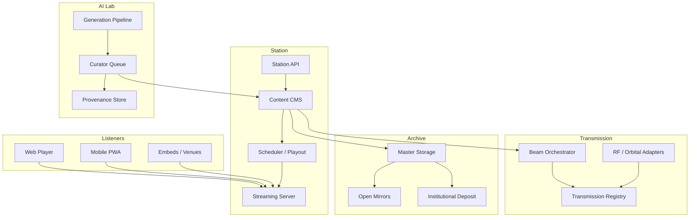

# SpaceRadio Architecture

High-level technical design for agents implementing features. Stack choices are recommendations until code exists — prefer consistency once chosen.

## System map



## Core services

### 1. Station (streaming + CMS)

**Responsibilities:** 24/7 playout, playlists, missions, now-playing metadata, listener analytics.

**Recommended stack (MVP):**

| Layer | Option A (simple) | Option B (scalable) |
|-------|-------------------|---------------------|
| Stream | Icecast + Liquidsoap | LiveKit / managed streaming |
| CMS | Headless (Sanity, Strapi) | Custom admin on Postgres |
| API | Node/TypeScript or Python FastAPI | Same |
| DB | PostgreSQL | PostgreSQL |
| Media | S3-compatible object storage | Same + CDN |

**Key entities:**

```
Track
  id, title, duration, audio_url, waveform_url
  mission_id?, sponsor_id?
  provenance_id
  status: draft | review | published | archived

Playlist
  id, name, type: rotation | scheduled | one_off
  track_ids[], rules (optional)

Mission
  id, name, slug, description
  sponsor_id?, start_at, end_at
  branding_assets

Show
  id, title, host, schedule_cron
  playlist_id | live_input_url

NowPlaying
  track_id, started_at, listeners_estimate
```

### 2. AI Space Music Lab

**Responsibilities:** Generate candidates, human review, master export, provenance capture.

**Pipeline stages:**

1. **Brief** — mission context, tempo range, mood tags, duration target
2. **Structure** — form, key, BPM (MIDI or symbolic)
3. **Arrangement** — stems, instrumentation per Sound DNA
4. **Master** — loudness, format (FLAC master, AAC/Opus stream)
5. **Provenance** — model IDs, prompts hash, seed, human curator, license

**Integration points:**

- Output lands in CMS as `draft` tracks
- Curator UI: approve, reject, request revision
- Rejected outputs feed taste/training feedback (future)

### 3. Transmission Registry

**Responsibilities:** Immutable log of transmission events; public read API.

**Registry record:**

```
Transmission
  id                  # e.g. SR-TX-2026-00042
  tier                # 1 | 2 | 3 | 4
  status              # scheduled | active | completed | failed
  scheduled_at_utc
  completed_at_utc?
  track_ids[]
  payload_checksum    # SHA-256 of encoded payload
  metadata_uri        # JSON descriptor
  certificate_uri?    # Tier 1+ public certificate
  rf_frequency_hz?    # Tier 2+
  ground_station?     # Tier 2+
  norad_id?           # Tier 3+
  deep_space_target?  # Tier 4
  sponsor_id?
  public_notes
```

**Rules:**

- Append-only event log; corrections via superseding entries
- Tier must be explicit in API and UI
- No "completed" without `payload_checksum` and `completed_at_utc`

### 4. Eternity Archive

**Responsibilities:** Canonical masters, metadata export, mirror manifests.

- Master format: FLAC 48kHz/24-bit minimum
- Sidecar JSON: provenance + transmission history
- Periodic manifest published for mirrors (hash list)

## Frontend

**Recommended:** Next.js or Astro for marketing + app shell; React for player and dashboard.

**Routes (initial):**

| Route | Purpose |
|-------|---------|
| `/` | Landing, listen CTA |
| `/listen` | Player, now playing |
| `/missions` | Mission listing |
| `/missions/[slug]` | Mission detail + playlist |
| `/originals` | Catalog browse |
| `/transmissions` | Registry feed |
| `/transmissions/[id]` | Transmission detail + certificate |
| `/sponsors` | Partnership info |
| `/admin/*` | CMS, curator, beam scheduler (auth) |

## Auth & roles

| Role | Access |
|------|--------|
| `listener` | Public streams and registry |
| `curator` | QC queue, track publish |
| `producer` | Playlists, shows, missions |
| `transmission_ops` | Schedule beams, RF adapters |
| `sponsor` | Portal analytics (scoped) |
| `admin` | Full |

## Observability

- Stream health: silence detection, source disconnect alerts
- API latency and error budgets for `/now-playing` and registry
- Transmission job status with retry and dead-letter queue

## Security

- Signed URLs for masters; public stream URLs may be CDN tokens
- Sponsor portal: tenant-scoped data
- Admin: MFA for production
- No secrets in repo; env-based config

## MVP scope boundary

**In MVP:**

- Landing, waitlist, web player
- Icecast/Liquidsoap or hosted stream
- Minimal CMS (tracks + one rotation playlist)
- Provenance JSON sidecars
- Registry v0 (Tier 1 symbolic beams only)

**Out of MVP:**

- Mobile native apps
- Orbital adapter
- Creator revenue share
- Full sponsor portal

## Data flow: listener to transmission

1. Curator publishes track → CMS → playout rotation
2. Operator schedules Tier 1 beam → Beam Orchestrator encodes payload
3. Orchestrator writes `Transmission` row → optional public certificate
4. Master + provenance synced to archive bucket
5. Registry visible on `/transmissions`; now-playing links active transmission if any

## Conventions for new code

- TypeScript strict mode preferred
- API versioning: `/api/v1/`
- IDs: UUID internally; public transmission IDs human-readable (`SR-TX-YYYY-NNNNN`)
- Timestamps: UTC ISO 8601 in APIs and storage
- Design tokens for all UI colors and spacing — see [BRAND.md](BRAND.md)
