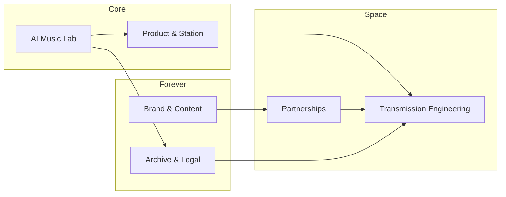

# SpaceRadio Roadmap

Phased project plan from greenfield to scaled cultural platform.

## Overview

| Phase | Timeline | Focus |
|-------|----------|-------|
| 0 — Foundation | Months 0–3 | Brand, legal, architecture, landing |
| 1 — The Station | Months 3–9 | 24/7 stream, CMS, apps, catalog |
| 2 — AI Music Lab | Months 6–15 | Sound DNA, pipeline, provenance |
| 3 — Transmission | Months 12–24 | Registry, RF, orbital, deep space |
| 4 — Sponsorships | Months 9–24 | Partner tiers, portal, programming |
| 5 — Eternity Archive | Months 18–36 | Mirrors, deposits, succession |
| 6 — Scale | Months 24–48 | Network, creators, hardware, media |

Phases overlap by design. Sponsorships and AI Lab run parallel to Station build.

---

## Phase 0 — Foundation (Months 0–3)

**Goal:** Establish brand, legal footing, technical direction, and public presence.

| ID | Project | Deliverables |
|----|---------|--------------|
| 0.1 | Brand & Mission | Identity, manifesto, design tokens |
| 0.2 | Legal & IP | Entity, licensing model, AI composition policy |
| 0.3 | Architecture Doc | Streaming, AI, transmission, archive design |
| 0.4 | Landing + Waitlist | Site, email capture, sponsor inquiry |
| 0.5 | Sponsor Deck | Pitch for space primes, launch providers, museums |

**Milestone:** Public announcement — *"SpaceRadio is building the station that plays for the stars."*

---

## Phase 1 — The Station (Months 3–9)

**Goal:** Working radio product with measurable audience.

| ID | Project | Deliverables |
|----|---------|--------------|
| 1.1 | Streaming Platform | 24/7 stream, schedule, track metadata |
| 1.2 | Content CMS | Upload tracks, playlists, missions |
| 1.3 | Listener Apps | Web player, PWA, optional CarPlay/Android Auto |
| 1.4 | First Catalog | 50–100 AI + curated space tracks |
| 1.5 | Live Shows | Weekly hosted segments (human + AI voice) |
| 1.6 | Analytics | Listeners, geography, sponsor impressions |

**Milestone:** Public beta — live stream with branded programming.

---

## Phase 2 — AI Space Music Lab (Months 6–15)

**Goal:** Proprietary Sound DNA and scalable curated catalog.

| ID | Project | Deliverables |
|----|---------|--------------|
| 2.1 | Sound DNA | Style guide: tempo, instrumentation, motifs |
| 2.2 | Composition Pipeline | Prompt → structure → arrangement → master |
| 2.3 | Human-in-the-Loop QC | Curator approve/reject; taste model over time |
| 2.4 | Mission-Linked Generation | Music tied to launches, eclipses, JWST, Mars sols |
| 2.5 | Artist Collaborations | Remix packs, licensed human + AI hybrids |
| 2.6 | Rights & Provenance | Model version, seed, license, sponsor attribution |

**Milestone:** SpaceRadio Originals — 500+ tracks with documented provenance.

---

## Phase 3 — Space Transmission (Months 12–24)

**Goal:** Music leaves Earth — technically verified and publicly logged.

### Transmission tiers

| Tier | Name | Description |
|------|------|-------------|
| 1 | Symbolic | Digital beam, countdown, public certificate |
| 2 | Terrestrial | Licensed RF via HAM, ground stations, SDR |
| 3 | Orbital | Cubesat or hosted payload data burst |
| 4 | Deep Space | Research dish time, encoded deep-space message |

| ID | Project | Deliverables |
|----|---------|--------------|
| 3.1 | Transmission Registry | What, when, frequency/coords, checksum, public record |
| 3.2 | Tier 1 — Digital Beam | Scheduled transmissions + certificates |
| 3.3 | Tier 2 — Ground RF | Legal RF path + observatory/radio club partner |
| 3.4 | Tier 3 — Orbital Payload | Sponsor-funded cubesat or rideshare slot |
| 3.5 | Open Protocol | Spec for audio fragment + metadata packets |
| 3.6 | Mission Dashboard | Live map: beams, passes, deep-space windows |

**Milestone:** First verified off-planet transmission — documented and sponsor-attributed.

---

## Phase 4 — Sponsorships & Partnerships (Months 9–24)

**Goal:** Space industry funds and co-brands the station.

| ID | Project | Deliverables |
|----|---------|--------------|
| 4.1 | Sponsor Portal | Analytics, assets, co-brand guidelines |
| 4.2 | Sponsored Programming | Named hours: Artemis, Mars Relay, Commercial Space |
| 4.3 | Education Pack | K–12 curriculum tied to transmissions |
| 4.4 | Events | Launch listening parties, planetarium sync |
| 4.5 | Grants & Nonprofit | 501(c)(3) or fiscal sponsor for outreach |

**Milestone:** First Tier-1 sponsor (≥$250K or equivalent in-kind).

See [SPONSORSHIPS.md](SPONSORSHIPS.md) for tier details.

---

## Phase 5 — Eternity Archive (Months 18–36)

**Goal:** Catalog survives company failure and cultural drift.

| ID | Project | Deliverables |
|----|---------|--------------|
| 5.1 | Canonical Archive | Lossless masters + metadata, geo-redundant storage |
| 5.2 | Open Mirror Network | Torrent/IPFS/institutional mirrors |
| 5.3 | Time Capsule Formats | Optical disc, steel plate, ceramic with archival partners |
| 5.4 | Golden Record 2.0 | Curated message album + encoding spec |
| 5.5 | Succession Plan | Trust/foundation owning catalog and transmission rights |
| 5.6 | Century API | Stable read-only API with funded longevity model |

**Milestone:** Archive deposited with two+ independent institutions.

---

## Phase 6 — Scale & Culture (Months 24–48)

**Goal:** Default audio layer of the space age.

| ID | Project | Deliverables |
|----|---------|--------------|
| 6.1 | SpaceRadio Network | Multiple channels by genre and region |
| 6.2 | Creator Platform | Submit, AI assist, revenue share |
| 6.3 | Hardware | Speaker, mission-control desk radio, simulator embeds |
| 6.4 | Games & Metaverse | VR observatory, sim partnerships |
| 6.5 | Film & Media | Licensed beds for documentaries |
| 6.6 | International | ESA, JAXA, and regional editions |

**Milestone:** 1M monthly listeners + named sponsor on orbital transmission.

---

## Team workstreams

| Track | Roles |
|-------|-------|
| Station | Full-stack, streaming, mobile |
| AI Music | ML audio, composers, curators |
| Space | RF engineer, satcom, partnerships |
| Business | Sponsor sales, legal, grants |
| Story | Creative director, hosts, film |

---

## First 90 days — sprint plan

| Week | Focus |
|------|-------|
| 1–2 | Brand, domain, architecture, repo bootstrap |
| 3–4 | Landing site, waitlist, 10 AI pilot tracks |
| 5–6 | 24/7 stream MVP |
| 7–8 | Sponsor deck, outreach to 20 targets |
| 9–10 | Transmission Registry v0, first symbolic beam |
| 11–12 | Beta launch tied to space calendar event |

---

## Phase KPIs

| Phase | KPI |
|-------|-----|
| 0 | Waitlist signups, 1+ sponsor meeting |
| 1 | 1K beta listeners, 8 hrs/day original programming |
| 2 | 500 catalog tracks, <20% curator reject rate |
| 3 | 1 verified non-internet transmission |
| 4 | 1 major sponsor |
| 5 | Archive in 2+ institutions |
| 6 | 1M MAU, orbital transmission with sponsor |
