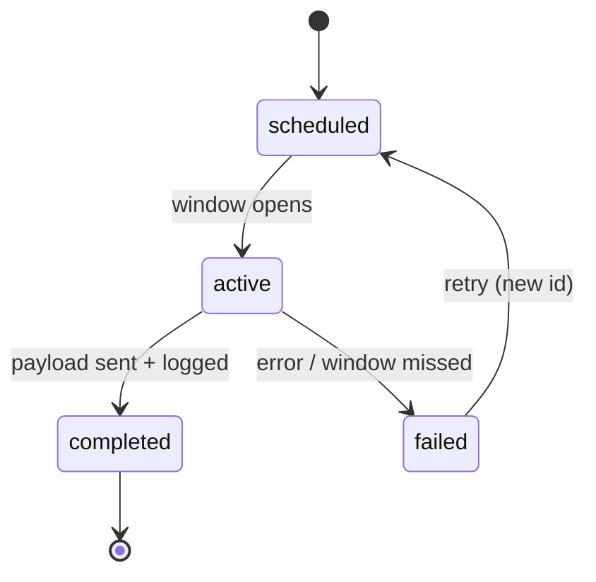

# SpaceRadio Transmission Program

Off-Earth broadcast tiers, protocols, and registry standards.

## Purpose

The Transmission Program turns SpaceRadio from metaphor into record. Every event is logged, tier-labeled, and publicly auditable.

## Tier definitions

| Tier | Name | What happens | Verification |
|------|------|--------------|--------------|
| **1** | Symbolic | Payload encoded; registry entry; optional public certificate; scheduled "beam" moment in product | Checksum in registry + timestamp |
| **2** | Terrestrial RF | Licensed RF emission from ground station or partner array | Frequency, station, operator log, checksum |
| **3** | Orbital | Payload uplinked; downlink or on-orbit broadcast from satellite | NORAD ID, pass times, uplink confirmation |
| **4** | Deep Space | Message encoded for deep-space comm path (dish time, interplanetary scheme) | Observatory log, target ephemeris, checksum |

**Agent rule:** UI and copy must always show tier. Never describe Tier 1 as physical deep-space transmission.

## Transmission lifecycle



## Registry ID format

```
SR-TX-{YYYY}-{NNNNN}
```

Example: `SR-TX-2026-00001`

- Sequential per calendar year
- Immutable; retries get new IDs with `supersedes` optional field

## Payload specification (v0)

### Tier 1 symbolic payload

JSON descriptor + audio fragment reference.

```json
{
  "version": "0.1",
  "transmission_id": "SR-TX-2026-00001",
  "tier": 1,
  "scheduled_at_utc": "2026-06-21T12:00:00Z",
  "tracks": [
    {
      "track_id": "uuid",
      "title": "Signal Lock",
      "duration_sec": 312,
      "audio_sha256": "..."
    }
  ],
  "payload_sha256": "...",
  "sponsor_id": null,
  "notes": "Solstice symbolic beam"
}
```

Audio may be:

- Full track checksum only (reference to archive master), or
- Encoded excerpt (e.g. 30 sec) embedded in payload package

### Tier 2+ extensions

```json
{
  "rf": {
    "frequency_hz": 145800000,
    "mode": "FM",
    "ground_station": "callsign or facility id",
    "operator": "[TBD]",
    "emission_log_uri": "https://..."
  }
}
```

```json
{
  "orbital": {
    "norad_id": 99999,
    "pass_start_utc": "...",
    "pass_end_utc": "...",
    "uplink_log_uri": "..."
  }
}
```

## Public certificate (Tier 1+)

Human-readable page at `/transmissions/{id}` containing:

- Transmission ID and tier badge
- UTC schedule and completion time
- Track list with links to catalog
- Payload SHA-256
- Optional sponsor credit
- QR linking to registry JSON

## Beam Orchestrator (service)

**Responsibilities:**

1. Accept schedule request (track IDs, tier, window)
2. Build payload; compute checksums
3. Write `scheduled` registry entry
4. At window: transition to `active` → execute adapter → `completed` or `failed`
5. Emit webhook/event for UI and social

**Adapters by tier:**

| Tier | Adapter |
|------|---------|
| 1 | `SymbolicAdapter` — registry + certificate only |
| 2 | `RFAdapter` — partner API or manual ops confirmation |
| 3 | `OrbitalAdapter` — sat pass scheduler + uplink vendor |
| 4 | `DeepSpaceAdapter` — observatory partner workflow |

MVP implements `SymbolicAdapter` only.

## Encoding philosophy (Tier 3–4)

Long-horizon goal: self-describing, redundant encoding — inspired by Voyager Golden Record but modernized.

**Design principles for future spec:**

- Open format documentation
- Error correction (e.g. Reed-Solomon) on critical metadata
- Short audio excerpt + mathematical description of full piece
- Universal time reference (UTC + pulsar epoch optional in v2)

Document as `docs/specs/encoding-v1.md` when Phase 3.5 begins.

## Legal and regulatory notes

- Tier 2 requires compliance with national telecom regulations
- Orbital uplink requires license and coordination
- Deep-space use of government dishes requires formal partnership
- Agents must not implement RF transmission without explicit legal review flag

## Dashboard (Phase 3.6)

**Map layers:**

- Scheduled beams (global, not "aimed" falsely for Tier 1)
- Tier 2: ground station locations
- Tier 3: satellite ground track for pass window
- Tier 4: target body ephemeris (informational)

## Event ideas (editorial)

| Event | Tier | Tie-in |
|-------|------|--------|
| Solstice beam | 1 | Annual tradition |
| Launch sync | 1–2 | Liftoff timestamp |
| Apollo anniversary | 1 | Heritage mission |
| Partner dish night | 2 | Ham / observatory open house |
| Cubesat demo | 3 | Educational payload |
| Interstellar tribute | 4 | Voyager pale blue dot moment |

## Failure handling

| Failure | User-facing message |
|---------|---------------------|
| Window missed | "Transmission window closed. Registry updated. Reschedule: [link]" |
| RF denial | "Terrestrial transmission not completed. Tier 2 verification pending." |
| Partial uplink | "Orbital pass incomplete. Retry scheduled: SR-TX-YYYY-NNNNN" |

Never show `completed` without verification fields for that tier.

## MVP checklist

- [ ] Registry schema and append-only API
- [ ] SymbolicAdapter
- [ ] `/transmissions` public list
- [ ] `/transmissions/[id]` certificate page
- [ ] Admin: schedule Tier 1 beam
- [ ] Link from now-playing when beam active

## Sample registry entries (demo seed)

**SR-TX-2026-00001** — Tier 1, completed, track *Signal Lock*, solstice symbolic beam.

**SR-TX-2026-00002** — Tier 1, scheduled, track *Apogee*, demo sponsor `[Sponsor TBD]`.

Mark demo data with `"demo": true` in JSON.
