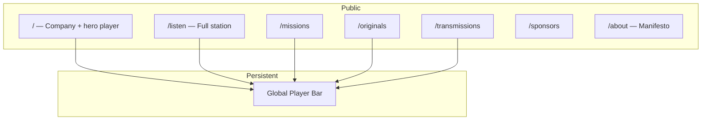
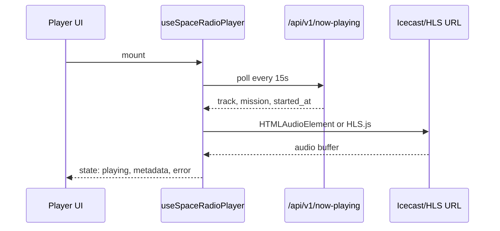

# SpaceRadio Web Experience

Company website + 24/7 radio player. Applies [taste-skill](https://github.com/Leonxlnx/taste-skill) (`design-taste-frontend` v2) to SpaceRadio brand and architecture docs.

**Related:** [BRAND.md](BRAND.md) · [ARCHITECTURE.md](ARCHITECTURE.md) · [TRANSMISSION.md](TRANSMISSION.md) · [CONTENT.md](CONTENT.md)

---

## 0. Taste-Skill Design Read

Before any implementation, agents must declare:

> **Reading this as:** premium cultural/media landing for space-interested listeners and sponsor prospects, with a dark mission-control / observatory language, leaning toward Next.js App Router + Tailwind v4 + Geist + JetBrains Mono + restrained orbital motion (not sci-fi arcade).

### Brief signals (from SpaceRadio docs)

| Signal | Inference |
|--------|-----------|
| Page kind | Consumer/cultural landing + embedded product (live radio) |
| Vibe | Mission control meets art house; awe without hype |
| Audience | Listeners first; sponsors second; institutions third |
| Brand assets | Void palette, gold signal, cyan beam — see [BRAND.md](BRAND.md) |
| Constraints | Transmission tier honesty; no fake deep-space claims for Tier 1 |

### Anti-default discipline (taste-skill §0.D)

**Do not ship:**

- Centered hero over purple/blue mesh gradient
- Three equal "Features" cards with rocket emoji
- Generic glassmorphism on every surface
- Inter + slate-900 as default stack
- Div-based fake radio UI (fake waveforms drawn in CSS)
- "Your vibes to infinity" copy

**Do ship:**

- Asymmetric split hero with **real** player or spectrogram asset
- Mission-control data density only where data is real (player, registry)
- One accent family locked: **gold signal** primary, **cyan beam** for live/transmission states only

---

## 1. Three Dials (SpaceRadio preset)

| Dial | Value | Rationale |
|------|-------|-----------|
| **DESIGN_VARIANCE** | **8** | Split layouts, asymmetric grids, player offset from center — not template hero |
| **MOTION_INTENSITY** | **6** | Scroll reveals, signal pulse on live indicator, waveform scrub — no scroll-hijack carnival |
| **VISUAL_DENSITY** | **4** | Airy marketing sections; denser "cockpit" only in player bar and registry |

Override conversationally only if the user asks (e.g. "more minimal" → VARIANCE 5, MOTION 3, DENSITY 2).

---

## 2. Design System Map

### Foundation (taste-skill §2.B — aesthetic, not corporate DS)

No Fluent/Carbon. Build with:

| Layer | Choice |
|-------|--------|
| Framework | **Next.js 15** App Router, RSC default |
| Styling | **Tailwind v4** (`@tailwindcss/postcss`) |
| Animation | **Motion** (`motion/react`) for UI; **GSAP + ScrollTrigger** for one transmission timeline section max |
| Icons | **@phosphor-icons/react** — `stroke` weight 1.5 |
| Fonts | **Geist** (sans) + **JetBrains Mono** (registry, timestamps) via `next/font` |
| Components | Own primitives; shadcn/ui only if needed — **never default unstyled shadcn** |

### SpaceRadio palette (replaces taste-skill neutral default)

Lock for entire site (dark theme only at launch):

```css
:root {
  --color-void: #0a0e17;
  --color-void-elevated: #12182a;
  --color-void-panel: #1a2236;
  --color-signal: #e8b84a;      /* primary accent — CTAs, focus */
  --color-beam: #5ec8e8;        /* live / transmission active ONLY */
  --color-orbit: #6b5b95;       /* tertiary, missions */
  --color-text: #e8eaed;
  --color-muted: #8b95a8;
  --color-border: rgba(232, 184, 74, 0.12);
  --color-danger: #e85d5d;
}
```

**Color consistency lock:** Gold for actions and brand emphasis. Cyan exclusively for LIVE, beam active, transmission in progress. No third accent competing on the same page.

### Typography scale

| Role | Font | Classes |
|------|------|---------|
| Display | Geist | `text-4xl md:text-5xl lg:text-6xl tracking-tight leading-[1.05]` |
| Section | Geist | `text-2xl md:text-3xl tracking-tight` |
| Body | Geist | `text-base text-[var(--color-muted)] leading-relaxed max-w-[65ch]` |
| Telemetry | JetBrains Mono | `text-xs uppercase tracking-wider` — IDs, UTC, BPM, tier badges |

**Banned:** Fraunces, Instrument Serif, random serif word in sans headlines.

### Shape system

| Element | Radius |
|---------|--------|
| Cards / panels | `rounded-2xl` (16px) |
| Buttons | `rounded-full` (pill) |
| Inputs | `rounded-lg` (8px) |
| Player shell | `rounded-2xl` |

---

## 3. Information Architecture



### Navigation (desktop, single line, max 72px height)

```
SpaceRadio | Listen | Missions | Originals | Transmissions | Sponsors     [● LIVE] [Play]
```

- `[● LIVE]` = cyan pulse when stream connected
- Play opens/expands player if collapsed
- Mobile: hamburger + persistent mini player docked bottom

---

## 4. Page Architectures

### 4.1 Home `/` — Company + listen CTA

**Layout family:** Split screen (VARIANCE 8). **Not** centered hero.

```
┌─────────────────────────────────────────────────────────────┐
│ NAV                                                         │
├──────────────────────────┬──────────────────────────────────┤
│ LEFT 55%                 │ RIGHT 45%                        │
│                          │                                  │
│ Eyebrow: 24/7 SPACE RADIO│  ┌────────────────────────────┐  │
│ (only eyebrow on page)   │  │     LIVE PLAYER CARD       │  │
│                          │  │  waveform · now playing    │  │
│ Headline (max 2 lines):  │  │  mission tag · tier badge  │  │
│ Music for the stars.     │  │  [ ▶ Listen ]              │  │
│                          │  └────────────────────────────┘  │
│ Sub (≤20 words):         │                                  │
│ Original compositions,   │  Real asset: dish photo or       │
│ logged transmissions.    │  generated spectrogram image     │
│                          │                                  │
│ [Listen Live] [Registry] │                                  │
├──────────────────────────┴──────────────────────────────────┤
│ TRANSMISSION TICKER (1 marquee max — recent SR-TX IDs)      │
├─────────────────────────────────────────────────────────────┤
│ BENTO 3-cell: Station | AI Lab | Eternity Archive           │
│ (each cell: image or tinted panel — not 3 white cards)      │
├─────────────────────────────────────────────────────────────┤
│ SPLIT: Manifesto quote + mission control photo              │
├─────────────────────────────────────────────────────────────┤
│ ORIGINALS — horizontal scroll-snap, 5 track cards           │
├─────────────────────────────────────────────────────────────┤
│ SPONSORS — logo row UNDER hero (not in hero)                │
├─────────────────────────────────────────────────────────────┤
│ WAITLIST — single intent CTA only                           │
├─────────────────────────────────────────────────────────────┤
│ FOOTER — mono registry link, disclaimer                     │
└─────────────────────────────────────────────────────────────┘
```

**Hero copy (from BRAND.md):**

- Headline: *Music for the stars.*
- Sub: *SpaceRadio plays original music for Earth and logs every transmission toward the stars.*
- Primary CTA: **Listen Live**
- Secondary CTA: **View Registry** (different intent — OK)

**Hero rules:** Max 4 text elements. No sponsor logos in hero. `min-h-[100dvh]` not `h-screen`. Top padding max `pt-24`.

### 4.2 Listen `/listen` — Full broadcast experience

Primary product surface. Density rises to **5–6** here.

```
┌─────────────────────────────────────────────────────────────┐
│ STATION HEADER                                              │
│ Deep Orbit · 142 listeners · UTC 12:04:33                   │
├─────────────────────────────────────────────────────────────┤
│                                                             │
│              MAIN PLAYER (large)                            │
│         ┌─────────────────────────────────┐                 │
│         │  Album art / generative visual   │                │
│         │  ─── waveform scrub (live) ───   │                │
│         │  Signal Lock                     │                │
│         │  Deep Orbit · 72 BPM · SR-OR-042 │                │
│         │  [◀◀] [▶/❚❚] [▶▶]  vol ────●    │                │
│         └─────────────────────────────────┘                 │
│                                                             │
├──────────────────────────┬──────────────────────────────────┤
│ UP NEXT (queue)          │ ON AIR MISSION                   │
│ 5 tracks scroll-snap     │ Artemis Hour [Sponsor TBD]       │
├──────────────────────────┴──────────────────────────────────┤
│ SCHEDULE — today's shows (grouped, not 20-row table)        │
└─────────────────────────────────────────────────────────────┘
```

### 4.3 Transmissions `/transmissions`

Registry feed — cockpit density **5**.

- Filter pills: All | Tier 1 | Tier 2+ | Scheduled
- Cards: mono ID, tier badge, UTC, status, checksum truncated
- No em-dashes in UI copy

### 4.4 Missions `/missions/[slug]`

- Mission hero image (real astronomy)
- Sponsor strip if present
- Embedded mini-player filtered to mission rotation
- Linked transmissions

### 4.5 Sponsors `/sponsors`

- Trust-first layout (VARIANCE 6 here)
- Package cards: Signal / Orbit / Deep Space
- One contact CTA site-wide label: **Partner With Us**

---

## 5. Radio Player — Function Spec

The player is a **real** interactive component (taste-skill §4.8 — no fake div UI).

### 5.1 Player modes

| Mode | Where | Behavior |
|------|-------|----------|
| **Mini** | Global bottom bar | Title, play/pause, LIVE dot, expand chevron |
| **Card** | Home hero | Same as mini + waveform + mission tag |
| **Full** | `/listen` | Volume, queue, schedule, provenance link |

### 5.2 Audio engine



**Stream URL:** Env `NEXT_PUBLIC_STREAM_URL` (Icecast MP3 or HLS).

**Metadata:** REST poll `GET /api/v1/now-playing` — sync title on track change; do not rely on ICY-only for MVP.

### 5.3 Player state machine

```
idle → connecting → playing ⇄ paused
         ↓              ↓
       error         buffering
```

| State | UI |
|-------|-----|
| `connecting` | Skeleton waveform + "Acquiring signal…" |
| `playing` | Cyan LIVE pulse; waveform animates |
| `paused` | Gold pause icon; waveform static |
| `buffering` | Subtle shimmer on progress |
| `error` | Inline message + Retry — "Signal lost. Reacquiring." |

### 5.4 Controls

| Control | Behavior |
|---------|----------|
| Play/Pause | Toggles `HTMLAudioElement` |
| Volume | Slider 0–1, persists `localStorage` |
| Mute | Icon toggle |
| Expand | Mini → Full route or sheet |
| Track info | Links to `/originals/[id]` if catalog exists |
| Mission tag | Links to `/missions/[slug]` |
| Transmission badge | If beam active, links to `/transmissions/[id]` |

**Live stream note:** Skip/previous disabled for true live; show tooltip "Live broadcast — no skip." Queue shows *up next* from schedule API, not stream seek.

### 5.5 Waveform visualization

- **Live:** Canvas or Web Audio API analyser on stream (when CORS allows) OR CSS animated bars driven by `playing` state
- **On-demand tracks (future):** Precomputed waveform JSON from CMS
- Respect `prefers-reduced-motion`: static bars + LIVE text only

### 5.6 Accessibility

- `aria-live="polite"` on now-playing title region
- Play button `aria-label="Play SpaceRadio live stream"`
- Keyboard: Space = play/pause when player focused
- WCAG AA contrast on all controls (taste-skill §4.5)

---

## 6. Component Tree

```
app/
├── layout.tsx              # Theme lock dark, fonts, PlayerProvider
├── page.tsx                # Home
├── listen/page.tsx
├── missions/[slug]/page.tsx
├── originals/page.tsx
├── transmissions/page.tsx
└── api/v1/now-playing/route.ts

components/
├── layout/
│   ├── SiteNav.tsx
│   ├── GlobalPlayerBar.tsx      # client — mini player
│   └── Footer.tsx
├── player/
│   ├── PlayerProvider.tsx       # client — Zustand or context
│   ├── PlayerCard.tsx           # hero card
│   ├── PlayerFull.tsx           # listen page
│   ├── Waveform.tsx             # client — canvas
│   ├── NowPlayingMeta.tsx
│   └── LiveIndicator.tsx        # cyan pulse
├── marketing/
│   ├── HeroSplit.tsx
│   ├── TransmissionTicker.tsx   # only marquee on site
│   ├── BentoPillars.tsx
│   ├── OriginalsRail.tsx
│   └── SponsorLogos.tsx
├── registry/
│   ├── TransmissionCard.tsx
│   └── TierBadge.tsx
└── ui/
    ├── Button.tsx
    ├── Panel.tsx
    └── Skeleton.tsx
```

**RSC safety:** Player leaves are `"use client"`. Marketing shells are Server Components with client islands.

---

## 7. Motion Plan (MOTION_INTENSITY: 6)

Each animation needs a **one-sentence motivation** (taste-skill §5).

| Element | Motion | Why |
|---------|--------|-----|
| Hero player card entry | Fade + 12px rise, 0.5s spring | Draw eye to primary action |
| LIVE indicator | Soft cyan pulse 2s loop | Communicates broadcast state |
| Section reveals | Motion `whileInView` once | Hierarchy on scroll |
| Transmission ticker | Single horizontal marquee | Registry feels alive |
| GSAP transmission timeline | Sticky-stack on `/about` only | Story: Tier 1→4 progression |
| Button hover | `scale-[0.98]` on active | Tactile feedback |

**Banned:** Second marquee. Scroll-hijack horizontal pan on home. Infinite pulse on every card.

**Reduced motion:** `useReducedMotion()` disables GSAP, marquee, pulse; static LIVE badge remains.

---

## 8. API Contracts (Player + Pages)

### `GET /api/v1/now-playing`

```json
{
  "track": {
    "id": "uuid",
    "title": "Signal Lock",
    "artist": "SpaceRadio Originals",
    "duration_sec": 312,
    "bpm": 72,
    "catalog_id": "SR-OR-042"
  },
  "mission": {
    "slug": "deep-orbit",
    "name": "Deep Orbit"
  },
  "show": {
    "title": "Mission Control",
    "host": "Alex Chen"
  },
  "started_at_utc": "2026-06-06T12:00:00Z",
  "listeners_estimate": 142,
  "transmission": {
    "id": "SR-TX-2026-00002",
    "tier": 1,
    "status": "active"
  }
}
```

### `GET /api/v1/transmissions?limit=10`

Feeds home ticker and `/transmissions`.

### `GET /api/v1/schedule/today`

Powers listen page schedule — top 5 entries + "Full schedule" link.

---

## 9. Responsive Behavior

| Breakpoint | Home hero | Player |
|------------|-----------|--------|
| `< md` | Stack: copy then player card | Bottom dock mini player |
| `md–lg` | 50/50 split | Card in hero |
| `≥ lg` | 55/45 asymmetric | Card + spectrogram |

**Mobile:** `min-h-[100dvh]` hero; player card never below fold without scroll on phone — shorten copy if needed.

---

## 10. Image Strategy (taste-skill §4.8)

Required real visuals (generate or source):

| Placement | Asset |
|-----------|-------|
| Hero right | Radio dish array at dusk OR audio spectrogram on void background |
| Bento — Station | Mission control / console photography |
| Bento — AI Lab | Waveform sculpture or studio still |
| Bento — Archive | Vault / optical disc macro |
| Manifesto section | JWST or Apollo archive (licensed) |
| Missions | Per-mission astronomy still |

**No** div-drawn fake dashboards. **No** purple mesh blobs as hero background.

---

## 11. Taste-Skill Pre-Flight (SpaceRadio checklist)

Before shipping any page, verify:

- [ ] Design read declared in PR or commit message
- [ ] Dials documented if overridden
- [ ] Dark theme locked — no mid-page light section
- [ ] Max 1 eyebrow per 3 sections
- [ ] Max 1 marquee (transmission ticker)
- [ ] Hero ≤ 2 lines headline, ≤ 20 word sub, fits viewport
- [ ] No em-dashes in visible copy
- [ ] No Inter as default font
- [ ] No AI purple gradient
- [ ] Gold + cyan accents only per rules
- [ ] Player is functional with stream URL — not mock
- [ ] Loading / error / empty states implemented
- [ ] Transmission tier shown on all off-Earth claims
- [ ] One CTA label per intent site-wide
- [ ] `prefers-reduced-motion` respected
- [ ] Copy self-audit — no hallucinated metrics

---

## 12. Install Taste-Skill for Agents

```bash
npx skills add https://github.com/Leonxlnx/taste-skill --skill "design-taste-frontend"
```

For stricter anti-slop during implementation:

```bash
npx skills add https://github.com/Leonxlnx/taste-skill --skill "high-end-visual-design"
```

**Agent workflow:**

1. Read this doc + [BRAND.md](BRAND.md)
2. Load taste-skill (`design-taste-frontend`)
3. Declare design read + dials (Section 0–1 above — use SpaceRadio preset unless user overrides)
4. Implement Next.js app per component tree (Section 6)
5. Run pre-flight (Section 11)

---

## 13. MVP Build Sequence

| Step | Output |
|------|--------|
| 1 | Next.js + Tailwind v4 + tokens + fonts |
| 2 | `PlayerProvider` + `GlobalPlayerBar` + stream connection |
| 3 | Home hero split + `PlayerCard` |
| 4 | `/listen` full player |
| 5 | Mock `/api/v1/now-playing` → replace with CMS |
| 6 | `/transmissions` registry list |
| 7 | Waitlist form + sponsor footer |
| 8 | Real images + motion polish + pre-flight |

---

## 14. Wireframe — Global Player Bar (persistent)

```
┌──────────────────────────────────────────────────────────────────┐
│ ▮▮ Signal Lock — Deep Orbit          ● LIVE   [ ❚❚ ]   [ ↑ ]   │
└──────────────────────────────────────────────────────────────────┘
  ↑ mono catalog ID optional          cyan    pause   expand
```

Sits `fixed bottom-0` on mobile; `sticky bottom-0` or docked below nav on desktop — never covers CTAs without safe-area padding.
